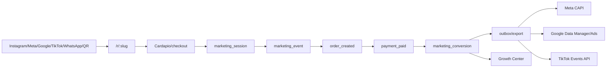

# MenuFlow - Growth Center, trafego pago e redes sociais

Data: 2026-06-24

Status: plano de produto e arquitetura. Ainda nao implementado no codigo.

## 1. Decisao

O MenuFlow deve ter um modulo **Growth Center** para ligar redes sociais, trafego pago, WhatsApp, cupons, pedidos e pagamentos.

O objetivo nao e comecar como "gerador de posts". O objetivo e provar venda:

```text
Instagram / Meta Ads / Google / TikTok / WhatsApp / QR
  -> link rastreavel
  -> cardapio / checkout
  -> pedido
  -> pagamento confirmado
  -> ROAS, CAC, ticket, recompra e margem
```

Regra principal: **medir antes de automatizar**.

## 2. Evidencias externas usadas

Fontes verificadas em 2026-06-24:

- Meta Conversions API: recomenda Pixel + Conversions API e deduplicacao de eventos quando browser e servidor enviam o mesmo evento.
- Google Ads API: a pagina de offline conversions alerta que, a partir de 15/06/2026, novos adotantes de `UploadClickConversion` devem usar Data Manager API.
- TikTok Events API: recomenda Events API junto com Pixel; deduplicacao e obrigatoria quando Pixel e Events API compartilham o mesmo evento.
- Instagram Graph API: permite gestao/publicacao de conteudo em contas profissionais, com OAuth e permissoes adequadas.

Fontes:

- Meta deduplicacao Pixel/CAPI: https://developers.facebook.com/documentation/ads-commerce/conversions-api/deduplicate-pixel-and-server-events
- Meta Marketing API: https://developers.facebook.com/documentation/ads-commerce/marketing-api
- Instagram APIs: https://developers.facebook.com/products/instagram/apis/
- Instagram content publishing: https://developers.facebook.com/docs/instagram-platform/content-publishing/
- Google Ads offline conversions: https://developers.google.com/google-ads/api/docs/conversions/upload-offline
- TikTok Events API: https://ads.tiktok.com/help/article/events-api?lang=en
- TikTok event deduplication: https://ads.tiktok.com/help/article/event-deduplication?lang=en

## 3. Estado atual do MenuFlow

Verificado no repo vivo:

- Backend Spring Boot/Kotlin em `backend/`.
- Frontend Next.js em `frontend/`.
- Mobile React Native em `mobile/`.
- Multi-tenant com banco de controle + tenant routing no backend.
- Entidades de pedido e pagamento ja existem (`Order`, `Payment`).
- Idempotencia ja existe (`IdempotencyKey`, `IdempotencyService`).
- Nao ha modulo de marketing/growth/tracking no codigo atual.

Conclusao: o Growth Center deve entrar como modulo novo, usando os eventos de `Order` e `Payment` existentes como fonte de conversao.

## 4. Modulos propostos

### `growth`

Modulo principal.

Responsabilidades:

- campanhas;
- links rastreaveis;
- sessoes de marketing;
- eventos;
- conversoes;
- dashboard;
- sugestoes de IA.

### `ads-integrations`

Adaptadores externos.

Responsabilidades:

- Meta CAPI;
- Google Ads/Data Manager;
- TikTok Events API;
- status de exportacao;
- retry via outbox.

### `social-studio`

Conteudo organico e redes sociais.

Responsabilidades:

- calendario editorial;
- criativos;
- posts;
- aprovacao humana;
- publicacao via Instagram/Facebook/TikTok quando as APIs permitirem.

### `customer-segments`

Segmentacao automatica.

Segmentos iniciais:

- novo cliente;
- cliente sumido 30/60/90 dias;
- fiel;
- alto ticket;
- aniversario;
- comprou X e nao comprou Y;
- carrinho abandonado;
- cliente de fim de semana.

### `ai-marketing`

Copiloto de crescimento.

Responsabilidades:

- gerar copy de post/anuncio;
- sugerir cupom;
- sugerir combo;
- explicar campanha ruim;
- criar calendario de conteudo;
- sugerir publico/segmento.

Restricao: IA gera rascunho e recomendacao; nao publica nem gasta dinheiro sem aprovacao humana.

## 5. Modelo de dados

### Controle ou tenant?

Recomendacao:

- dados de campanha, links, sessoes, eventos e conversoes devem ficar no **banco do tenant**, pois pertencem a hamburgueria.
- credenciais OAuth/API de plataformas podem ficar em tabela de controle ou tenant, desde que cifradas e escopadas por tenant. Para simplificar o MVP, manter no tenant; se houver painel SaaS central depois, migrar credenciais para controle com `tenantId`.

### Tabelas iniciais

```text
marketing_account
  id
  provider              // META | GOOGLE | TIKTOK | WHATSAPP | IFOOD | MANUAL
  external_account_id
  credentials_enc
  status                // CONNECTED | ERROR | DISCONNECTED
  created_at
  updated_at

marketing_campaign
  id
  provider              // META | GOOGLE | TIKTOK | INSTAGRAM_ORGANIC | WHATSAPP | MANUAL
  external_campaign_id
  name
  objective             // ORDER | REORDER | WINBACK | AWARENESS | LEAD
  budget_cents
  status                // DRAFT | ACTIVE | PAUSED | ENDED | ARCHIVED
  start_at
  end_at
  created_by_user_id
  created_at
  updated_at

marketing_creative
  id
  campaign_id
  type                  // TEXT | IMAGE | VIDEO | REEL | CAROUSEL
  copy
  asset_url
  approval_status       // DRAFT | APPROVED | REJECTED | PUBLISHED
  created_at
  updated_at

tracking_link
  id
  campaign_id
  slug
  destination_url
  utm_source
  utm_medium
  utm_campaign
  utm_content
  coupon_code
  active
  created_at

marketing_session
  id
  anonymous_id
  customer_id
  first_touch_campaign_id
  last_touch_campaign_id
  gclid
  gbraid
  wbraid
  fbclid
  ttclid
  consent_ads
  first_seen_at
  last_seen_at

marketing_event
  id
  session_id
  event_name
  event_id              // dedupe browser/server
  payload_json
  occurred_at

marketing_conversion
  id
  event_id
  campaign_id
  order_id
  payment_id
  revenue_cents
  gross_margin_cents
  occurred_at

marketing_conversion_export
  id
  conversion_id
  provider              // META | GOOGLE | TIKTOK
  status                // PENDING | SENT | FAILED | SKIPPED
  attempts
  last_error
  sent_at
  created_at
```

## 6. Eventos canonicos

Eventos do MenuFlow:

- `menu_view`
- `product_view`
- `add_to_cart`
- `checkout_started`
- `order_created`
- `payment_pending`
- `payment_paid`
- `order_delivered`
- `coupon_redeemed`
- `customer_reordered`

Evento que conta para ROAS:

- `payment_paid`

Nao usar clique, curtida ou lead como metrica principal de venda.

## 7. Fluxo tecnico



## 8. APIs propostas

### Publicas

```http
GET  /r/{slug}
POST /api/v1/growth/events
```

### Admin

```http
GET  /api/v1/growth/dashboard
GET  /api/v1/growth/campaigns
POST /api/v1/growth/campaigns
PATCH /api/v1/growth/campaigns/{id}
POST /api/v1/growth/tracking-links
GET  /api/v1/growth/segments
POST /api/v1/growth/ai/suggestions
POST /api/v1/growth/creatives/{id}/approve
```

### Internas de dominio

```text
GrowthService.trackOrderCreated(order)
GrowthService.trackPaymentPaid(payment)
GrowthService.enqueueConversionExport(conversion)
```

## 9. UX

### Tela: Central de Crescimento

KPIs:

- faturamento atribuido;
- ROAS;
- CAC;
- pedidos por canal;
- ticket medio;
- recompra;
- margem estimada.

Blocos:

- campanhas ativas;
- ranking de canais;
- funil por campanha;
- cupons usados;
- sugestoes da IA.

### Tela: Criador de campanha

Passos:

1. objetivo;
2. segmento;
3. oferta/cupom;
4. canal: Instagram Ads, Instagram organico, Facebook, Google, TikTok, WhatsApp, QR;
5. copy/criativo sugerido;
6. aprovacao;
7. link rastreavel;
8. acompanhar resultado.

### Tela: Social Studio

- calendario mensal;
- ideias de posts;
- rascunhos;
- aprovados;
- publicados;
- falhas de publicacao;
- biblioteca de criativos.

## 10. Instagram no plano

Instagram deve aparecer explicitamente como tres canais:

- `INSTAGRAM_ADS` - anuncios via Meta Ads.
- `INSTAGRAM_ORGANIC` - posts/reels/stories/publicacoes organicas via Instagram Graph API quando aplicavel.
- `INSTAGRAM_DM` - entrada de conversa/lead/pedido por direct, inicialmente manual ou via integracao futura.

No MVP, Instagram entra primeiro como:

- link rastreavel na bio;
- link rastreavel em stories/anuncios;
- campanha `INSTAGRAM_ADS`;
- campanha `INSTAGRAM_ORGANIC`;
- cupom por campanha.

Publicacao automatica fica para fase posterior, porque depende de OAuth, permissao de conta profissional e revisao de app.

## 11. IA e guardrails

IA pode:

- criar rascunho de post;
- criar copy de anuncio;
- sugerir cupom;
- sugerir combo;
- explicar por que campanha nao vendeu;
- sugerir segmento;
- criar calendario de conteudo.

IA nao pode:

- publicar sem aprovacao;
- gastar dinheiro;
- alterar budget;
- inventar preco/produto/desconto;
- exportar audiencia sensivel;
- mexer em pagamento.

## 12. Seguranca, LGPD e auditoria

Permissoes sugeridas:

- `growth:view`
- `growth:campaign:create`
- `growth:campaign:update`
- `growth:creative:approve`
- `growth:integration:manage`
- `growth:export`
- `growth:ai:use`

Auditar:

- conectar/desconectar conta;
- criar/editar campanha;
- aprovar criativo;
- gerar cupom;
- exportar conversao;
- exportar audiencia;
- alterar budget/status;
- usar IA.

Privacidade:

- consentimento de ads por sessao;
- opt-in para WhatsApp/SMS/email;
- hash de email/telefone quando exigido;
- segredo OAuth/API cifrado;
- fail-closed se faltar consentimento/token.

## 13. Fases

### Fase 1 - Rastreamento proprio

- criar `tracking_link`;
- rota `/r/{slug}`;
- captura UTM/click IDs;
- `marketing_session`;
- `marketing_event`;
- conversao interna por `payment_paid`;
- dashboard simples.

### Fase 2 - Campanhas, cupons e segmentos

- `marketing_campaign`;
- `marketing_creative`;
- cupom por campanha;
- segmentos automaticos;
- criador simples de campanha;
- IA gera rascunho.

### Fase 3 - Server-side conversions

- `marketing_conversion_export`;
- outbox/retry;
- Meta CAPI;
- TikTok Events API;
- Google Ads/Data Manager;
- status de integracoes.

### Fase 4 - Social Studio

- calendario social;
- rascunhos;
- aprovacoes;
- biblioteca de criativos;
- publicacao organica quando OAuth permitir.

### Fase 5 - Otimizacao assistida

- recomendacao de budget;
- alerta de campanha ruim;
- teste A/B;
- criativos vencedores;
- ROAS com margem.

## 14. Backlog inicial

### PR 1 - Fundacao Growth

- criar migrations;
- criar entidades;
- criar services;
- criar permissoes;
- criar README do modulo;
- testes unitarios de parser UTM/click IDs.

### PR 2 - Tracking link e sessao

- `GET /r/{slug}`;
- cookie/anonymous id;
- captura `utm`, `gclid`, `gbraid`, `wbraid`, `fbclid`, `ttclid`;
- consentimento basico.

### PR 3 - Eventos e conversao

- `POST /api/v1/growth/events`;
- `trackOrderCreated`;
- `trackPaymentPaid`;
- conversao idempotente por `eventId`;
- dashboard MVP.

### PR 4 - Campanhas e cupons

- CRUD de campanha;
- gerador de link rastreavel;
- cupom vinculado;
- segmentos iniciais.

### PR 5 - IA de rascunhos

- sugestao de copy;
- sugestao de combo/cupom;
- aprovacao humana;
- auditoria.

### PR 6 - Exportacao Meta/TikTok/Google

- outbox;
- Meta CAPI primeiro;
- TikTok depois;
- Google com Data Manager/Ads conforme elegibilidade atual;
- tela de status.

## 15. Definition of Done

- Dinheiro em centavos.
- Evento `payment_paid` idempotente.
- Tenant isolado.
- RBAC deny-by-default.
- Auditoria em acoes sensiveis.
- Segredos cifrados.
- Consentimento antes de exportar user data.
- Dashboard com estados vazio/loading/erro/sucesso.
- Teste de fluxo campanha -> link -> pedido -> pagamento -> conversao.
- Nenhuma IA publica ou gasta sem aprovacao.

## 16. Recomendacao final

Implementar primeiro:

```text
campanha -> link rastreavel -> pedido pago -> dashboard de resultado
```

Depois:

```text
Meta/TikTok/Google server-side -> IA de campanha -> Social Studio -> automacao assistida
```

## 17. Addendum - pesquisa profunda Growth 2026-06-24

Esta atualizacao tambem foi incorporada ao agente `Growth Marketing` em:

- `C:\Users\sdcot\OneDrive\POJETOS\agentes\growth-marketing\pesquisas\2026-06-24-pesquisa-profunda-growth.md`

Decisoes refinadas:

- Meta/TikTok: todo evento compartilhado por navegador e servidor deve carregar o mesmo `event_id` para deduplicacao.
- Google: para novas integracoes de offline conversions em 2026, planejar Data Manager API como caminho principal e preservar `gclid`, `gbraid` e `wbraid` ate `payment_paid`.
- WhatsApp: tratar como CRM de opt-in, templates, categorias e auditoria; nao como disparo promocional sem consentimento.
- Instagram: MVP deve usar link rastreavel, cupom, DM e fluxo manual. Publicacao via API fica para fase posterior com conta profissional, OAuth, permissoes e limites operacionais.
- IA: sempre copiloto auditavel. Pode sugerir campanha, verba, publico, criativo e cupom, mas humano aprova publicacao, desconto e gasto.
